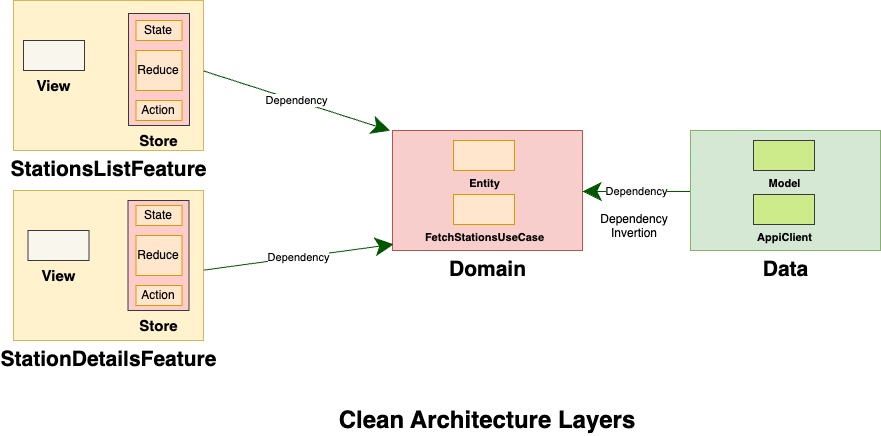
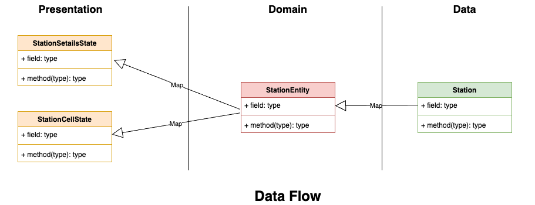
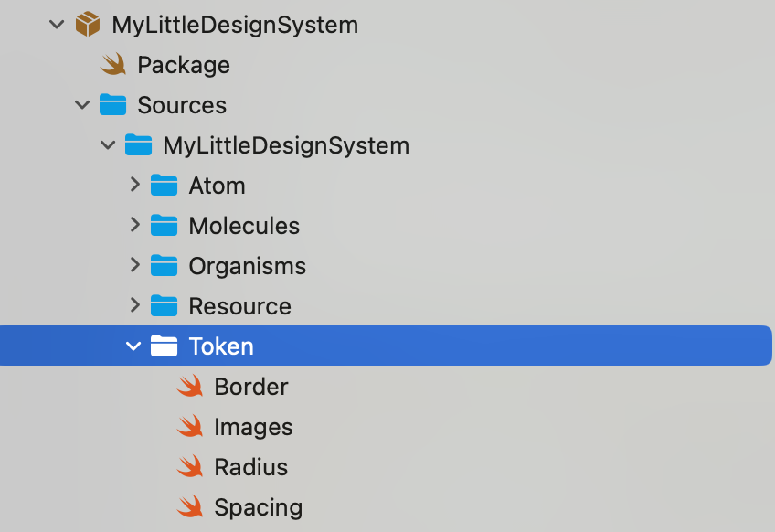

# MyLittleRadio

MyLittleRadio is an iOS application developed in the context of a technical test for Radio France. It uses SwiftUI, Clean Architecture principles and TCA (The Composable Architecture).

## Features

- **Station details**: A selected station will show Station details by the user on the list.
- **Streaming**: live streaming is integrated in the station detail view.

## Clean Architecture

The project has been done following a clean, modular architecture built on top of TCA and Clean Architecture principles:

### Modules

- **Data Module**: Responsible for API interactions; the Station model is directly mapped from server responses.
- **Domain Module**: Encapsulates business logic, includes Station entities mapped from the model of the Data module. 
- **Feature Modules** [Presentation]: Each feature module would have a composition of TCA components (Store, state, action) and View, which map Domain entities to UI-friendly view states.

## Data Flow and Model Mapping

Data flows through the app in clear separations in layering, abiding by Clean Architecture rules. Data is fetched raw from API and parsed into a `Station` model, specific to the data layer:.

2. **Domain Layer**: It maps the `Station` model from the data layer to a `StationEntity` in the domain layer. It encapsulates the business logics within itself and lets the core logics have the flexibility that do not depend on any of the changes in the external data format.
3. **Presentation Layer**: The `StationEntity` is transformed into view-specific states, which represent the UI requirements. This should make it a little clearer how the decoupling of UI Components from Business and Data Logic works for clean, testable, and maintainable code.

## Dependency Inversion

The project implements **dependency inversion** by re-implementing the initialization of `DependencyKey`. This approach allows the Domain layer to access the Data layer's functionality indirectly, respecting Clean Architecture principles by removing direct dependencies to domain. 

### Player Library

* Wraps AVPlayer framework, which is in charge of playing audio.

## Design System

The **Design System** according to Atomic design principle, to have reusable UI components:

- **UI Components**: Reusable SwiftUI components, animations, text images ...

- **Custom Constants**: reusabe and consistant elements-spacing, borders, and radius...

- **Asset Management**: Generated assets using Xcode's automatic asset catalog. however in order to make generated images public, we wrap asserts catalog images in an enum.

## TCA Integration

- The app is designed according TCA and presentation logic is well-separated into Reducers and Views.
- Main module starts only the initial module, which handles the application flow itself with least logic inside the main application module.

## Testing

- **Unit Testing**: New **Swift testing framework** used along with the TCA testing tools.
- **Test Plan**: Included test plan that combines the tests inside all modules. This makes testing easy.

## UI and UX Enhancements

- **ListTile Rendering**: Using of `List` instead of `LazyVStack` of stations list to efficiently use memory.

## Development Tools

- **SwiftFormat**: I runned SwiftFormat over the project with custom configuration file.
- **SwiftLint**: I used Swiftlint autocorrect to fix SwiftLint warnings automaticaly.
- **Periphery**: It helps in the detection of the unused code.
